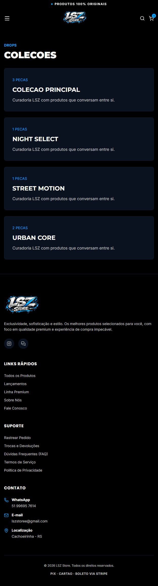

# LSZ Store — e-commerce full stack

Loja virtual de moda com catálogo responsivo, carrinho, área do cliente e painel administrativo. Desenvolvida com Next.js, React e TypeScript, com persistência em PostgreSQL e integração com Stripe Checkout e Connect.

**Status: em desenvolvimento.** Este repositório apresenta a implementação e a evolução do projeto. O onboarding financeiro, a validação completa dos fluxos de pagamento e a revisão operacional ainda são requisitos para considerar a loja pronta para operação.

[Visitar o site](https://lszstore2.vercel.app) · [Segurança](SECURITY.md) · [Configuração Stripe](STRIPE_CONNECT_SETUP.md)

## Telas do projeto

Capturas reais das telas públicas em 21/09/2026, em layout compacto. O catálogo ainda contém conteúdo demonstrativo. Nenhum pedido foi enviado para produzir as imagens.

<p>
  <a href="docs/screenshots/produto.png"></a>
  <a href="docs/screenshots/carrinho.png"></a>
  <a href="docs/screenshots/acesso-cliente.png"></a>
  <a href="docs/screenshots/colecoes.png"></a>
</p>

## Funcionalidades implementadas

- Catálogo com categorias, marcas, coleções, busca e detalhes de produto.
- Layout responsivo, banners em carrossel, variações de produto e controle de estoque por SKU.
- Carrinho, cupons e cálculo de frete no servidor.
- Cadastro, login, endereços, pedidos e recuperação de senha.
- Administração de produtos, pedidos, estoque, cupons, atendimento e financeiro.
- Checkout hospedado pela Stripe; métodos exibidos conforme habilitação e elegibilidade da conta.
- Connect Express com onboarding hospedado, Direct Charges e comissão configurável, padrão de 5%.
- Cobrança na conta principal enquanto a conta conectada não está ativa.
- Confirmação por webhook assinado, registro de eventos e tratamento de reembolsos e disputas.
- Integrações de e-mail, upload de imagens e frete; sitemap e metadados para SEO.

As funcionalidades financeiras dependem das configurações e liberações da Stripe. A existência do código e de testes automatizados não comprova, por si só, a conclusão de uma transação real de ponta a ponta.

## Tecnologias

| Camada | Tecnologias e finalidade |
| --- | --- |
| Aplicação | Next.js 16 (App Router, Route Handlers e renderização no servidor), React 19, TypeScript 5 |
| Interface | Tailwind CSS 4, Framer Motion, Lucide React, Embla Carousel, clsx e tailwind-merge |
| Servidor | Node.js; APIs implementadas com Route Handlers do Next.js |
| Banco | PostgreSQL, Prisma ORM 7, Prisma Migrate, driver pg e adaptador Prisma PostgreSQL |
| Autenticação | Implementação própria com Node.js Crypto: scrypt para senhas, HMAC para sessões e cookies HTTP-only |
| Pagamentos | Stripe SDK 22, Checkout, Connect Express e webhooks |
| Integrações | Melhor Envio para frete, ViaCEP para endereços, Resend para e-mail e Cloudinary para imagens |
| Imagens | Next Image e Sharp para validação e processamento de uploads |
| Qualidade | Vitest 4, ESLint 9 e verificação estática com TypeScript |
| Operação | Git, GitHub, GitHub Actions, Dependabot, Vercel e Docker Compose para PostgreSQL local |
| Legado | better-sqlite3 para importação opcional de uma base SQLite local; o banco atual é PostgreSQL |

As versões exatas e dependências transitivas estão em `package-lock.json`.

## Organização

```text
src/app/           Páginas, layouts e APIs
src/templates/     Componentes de interface por domínio
src/server/        Autenticação, serviços, segurança e acesso ao banco
src/shared/        Tipos, configuração pública e funções compartilhadas
prisma/            Schema, migrações e seed de desenvolvimento
tests/             Testes automatizados
scripts/           Operação e migração de dados
public/            Recursos visuais públicos
```

## Desenvolvimento local

Requisitos: Node.js 22.12+ compatível com as dependências, npm e PostgreSQL (ou Docker Compose).

```bash
npm ci
cp .env.example .env
docker compose up -d postgres
npm run db:deploy
npm run dev
```

No PowerShell, substitua `cp` por `Copy-Item .env.example .env`. Abra [localhost:3000](http://localhost:3000).

Configure `DATABASE_URL`, `DIRECT_URL` e um `AUTH_SECRET` aleatório. Para gerar o segredo localmente:

```bash
node -e "console.log(require('node:crypto').randomBytes(32).toString('hex'))"
```

### Dados demonstrativos opcionais

O comando `npm run db:seed` **apaga o conteúdo do banco local**. Use exclusivamente em uma base descartável. Ele recusa ambiente de produção e destinos de banco não locais.

No seu `.env` privado, defina `SEED_ADMIN_EMAIL`, `SEED_ADMIN_PASSWORD` (no mínimo 16 caracteres) e `ALLOW_DESTRUCTIVE_SEED=true`. Execute o seed e depois retorne `ALLOW_DESTRUCTIVE_SEED=false`. Não há senha administrativa padrão distribuída na versão atual.

### Serviços externos

O catálogo pode ser explorado sem credenciais de pagamento. O checkout exige Stripe configurado; `PAYMENT_PROVIDER=manual` não cria pagamentos reais nem oferece um checkout manual alternativo.

Para desenvolvimento financeiro, use chaves de teste e `STRIPE_LIVE_MODE=false`, com um endpoint de webhook correspondente. Cadastre os eventos descritos em [STRIPE_CONNECT_SETUP.md](STRIPE_CONNECT_SETUP.md). Nunca use credenciais de produção em demonstrações.

Resend, Melhor Envio e Cloudinary são configurados pelas variáveis descritas em `.env.example`. A disponibilidade de cada serviço depende dessas configurações; sem Resend configurado, e-mails não são enviados.

## Verificação e deploy

```bash
npm run lint
npm test
npx tsc --noEmit
npm run build
```

`npm run check` executa a sequência completa. O build pode precisar de acesso ao Google Fonts.

Na Vercel, configure os segredos pelo painel da hospedagem. `npm run vercel-build` aplica `prisma migrate deploy` quando `VERCEL_ENV=production` antes do build. Nunca execute o seed nem `migrate dev` em produção. Revise migrações e mantenha backups próprios do banco.

## Pendências e limites

- Concluir e validar onboarding, identidade e habilitações dos provedores financeiros.
- Validar pagamentos, falhas, eventos repetidos ou fora de ordem, reembolsos e disputas em ambiente de testes antes do lançamento.
- Revisar conteúdo comercial, políticas da loja, acessibilidade e experiência em dispositivos reais.
- Confirmar monitoramento, backups e recuperação operacional.
